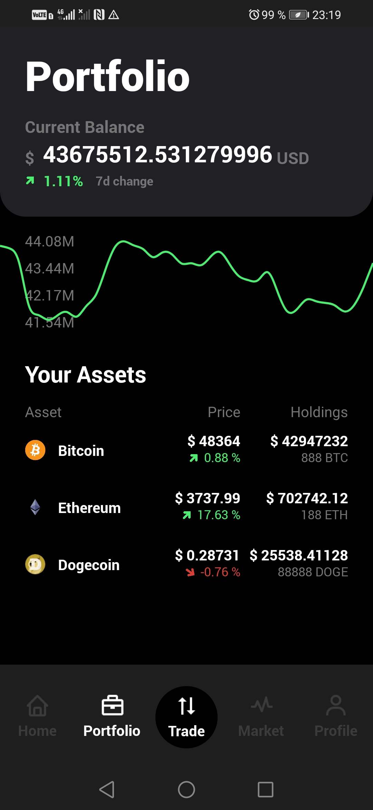
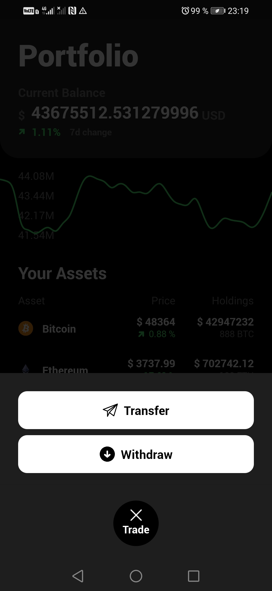
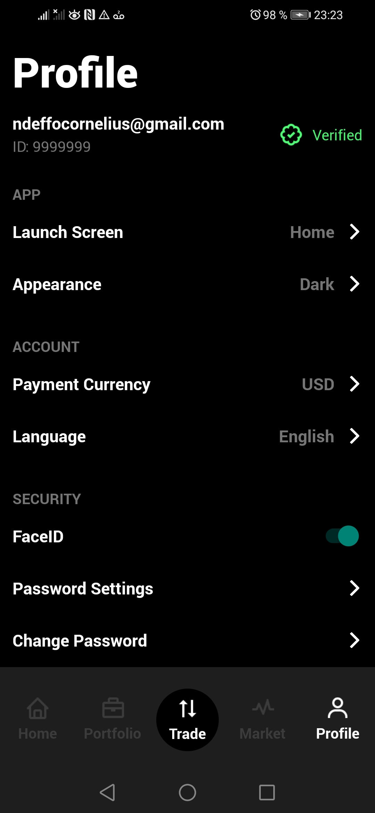

    

        

         
        
    
    
    

  

# CryptoC App (React Native)

    

        

              
              
              
              
              
        
    
    
    

  

CryptoC is a crypto currency application with design features and animations of advanced crypto currency apps, getting current crypto currency data from coingecko api.

## Features

- Home
- Portfolio
- Trade
- Market
- Profile

# Installation

1. Simply clone the project from this project. After cloning the repository:

# Setting up the sample app

- Open the project.

- Run `cd CryptoC`.

- Hit `npm i` to install the packages.

- Run `cd ios` then run `pod install` to install the pods. Once pods are installed run `cd ..` to go back to the root folder.

- Run the app on iOS using `npx react-native run-ios` & on Android using `npx react-native run-android`.

Build and run the Sample App.
